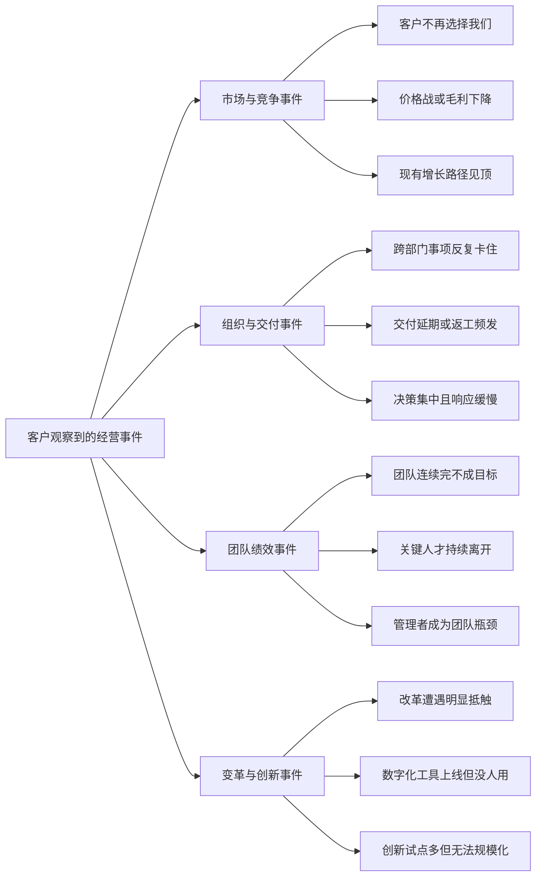

# A版：Lenny专项 Skill 参与的经营事件体系与题项映射

## 一、生成原则

本版不继承旧的8类事件。事件体系由四个专项 Skill 从原56题反向构建：

- `competitive-strategy`：识别需求侧竞争、差异化、定价权、切换成本和结构性优势；
- `org-design`：识别团队边界、职责、依赖、授权和组织阶段问题；
- `fixing-underperforming-teams`：区分能力、意愿、激励、资源、领导和工作设计问题；
- `leading-org-change`：识别利益相关者、试点、沟通、变革疲劳和组织采纳问题。

“经营事件”必须是客户可观察的现象；“原因假设”不能伪装成已确认事实。

## 二、事件总图

## 三、事件—核心题—关联事件—补充题映射

| ID | 客户可选择的经营事件 | 核心题 | 第一轮推荐方向 | 可能关联事件 | 关联事件触发的补充题 |
|---|---|---|---|---|---|
| A01 | 客户不再选择我们，流失或复购下降 | Q20市场洞察、Q21产品与定价、Q22客户管理、Q48客户体验 | 客户价值与竞争定位 | A02价格权下降；A05交付失效；A03增长路径见顶 | A02→Q2/Q5/Q24；A05→Q10/Q17/Q31；A03→Q1/Q49/Q50 |
| A02 | 价格战加剧、降价仍难成交或毛利下降 | Q2核心资源、Q5商业模式、Q21产品与定价、Q25财务预算 | 差异化与盈利模式 | A01客户流失；A03增长见顶；A07目标失效 | A01→Q20/Q22/Q48；A03→Q1/Q44/Q49；A07→Q4/Q14/Q30 |
| A03 | 原有获客或增长路径已经见顶 | Q1行业阶段、Q5商业模式、Q20市场洞察、Q49新商业模式 | 新增长路径与战略选择 | A01客户流失；A02价格权下降；A12创新难转化 | A01→Q21/Q22/Q48；A02→Q2/Q25；A12→Q3/Q44/Q45/Q55 |
| A04 | 跨部门事项反复卡住、职责互相推诿 | Q8组织匹配、Q9权责授权、Q10流程、Q41团队氛围 | 组织边界与协同机制 | A05交付延期；A06决策缓慢；A07目标失效 | A05→Q17/Q31/Q52；A06→Q6/Q29/Q53；A07→Q4/Q14/Q32 |
| A05 | 项目或订单经常延期、返工或质量不稳 | Q10流程、Q11人力结构、Q17质量、Q31跟踪反馈 | 交付体系与团队设置 | A04协同卡点；A07目标失效；A09管理者瓶颈 | A04→Q8/Q9/Q41；A07→Q14/Q30/Q32；A09→Q15/Q43/Q52 |
| A06 | 事项都等老板拍板，决策和响应越来越慢 | Q6治理决策、Q9授权、Q29数据决策、Q52流程敏捷 | 授权与决策机制 | A04协同卡点；A09管理者瓶颈；A10改革抵触 | A04→Q8/Q10/Q41；A09→Q14/Q31/Q43；A10→Q39/Q53/Q56 |
| A07 | 团队连续完不成目标，执行表现持续下降 | Q4战略解码、Q14绩效、Q30责任落实、Q32结果文化 | 团队绩效根因诊断 | A09管理者瓶颈；A04结构问题；A08人才流失 | A09→Q9/Q31/Q43；A04→Q8/Q10/Q41；A08→Q11/Q13/Q15 |
| A08 | 骨干离职、关键岗位空缺或新人留不住 | Q11人力结构、Q12招聘、Q13薪酬、Q15人才梯队 | 人才保留与团队能力 | A09管理者瓶颈；A07绩效失效；A10变革疲劳 | A09→Q14/Q31/Q43；A07→Q4/Q7/Q30/Q32；A10→Q39/Q40/Q41/Q56 |
| A09 | 某些管理者成为团队瓶颈或长期掩盖问题 | Q9授权、Q14绩效、Q31反馈、Q43领导示范 | 管理者与团队恢复 | A07目标失效；A08人才流失；A04结构错配 | A07→Q4/Q30/Q32；A08→Q11/Q13/Q15；A04→Q8/Q10/Q41 |
| A10 | 改革、重组或新制度遭到抵触和阳奉阴违 | Q39文化理念、Q41组织氛围、Q43领导示范、Q56变革管理 | 组织变革与利益相关者管理 | A11数字化采纳失败；A08人才流失；A06决策缓慢 | A11→Q28/Q29/Q52；A08→Q13/Q15/Q42；A06→Q6/Q9/Q53 |
| A11 | 系统或数字工具已经上线，但使用率低、仍靠手工 | Q28系统覆盖、Q29数据决策、Q52流程敏捷、Q56变革管理 | 数字化采纳与流程重构 | A04协同卡点；A06决策缓慢；A10改革抵触 | A04→Q8/Q10/Q41；A06→Q9/Q30/Q31；A10→Q39/Q43/Q53 |
| A12 | 创新项目和试点很多，但迟迟不能商业化或推广 | Q44创新投入、Q45创新组合、Q54创新激励、Q55成果转化 | 创新组合与规模化机制 | A03增长见顶；A10改革抵触；A06决策缓慢 | A03→Q1/Q20/Q49；A10→Q41/Q43/Q56；A06→Q9/Q29/Q53 |

## 四、原56题在A版中的处理边界

- Q16、Q18、Q19属于制造现场或客观运营事实，只在A05“交付延期/质量不稳”的制造业分支中按行业条件触发。
- Q23、Q24是A01—A03的市场销售补充题，不应仅凭“有团队/有账号”判断市场健康。
- Q26、Q27属于合规风险核验，不由这四个专项 Skill 独立给出咨询结论。
- Q33、Q34、Q35、Q36、Q37、Q38属于融资、投资并购和上市事项，超出A版四个专项 Skill 的主要边界，转交B版CEO经营事件体系。
- Q46、Q47、Q51属于创新能力证据，只在A12对应分支触发，不能用“有研发/有专利/有合作”直接替代创新成效。

## 五、动态问答规则

1. 客户先选择一个可观察事件，不选择“战略差”“组织差”等原因标签。
2. 系统只展示该事件3—4道核心题。
3. 第一轮只推荐一个专项方向，不显示置信度。
4. 根据具体答案触发1—3个关联事件，用户确认“是否也发生”。
5. 只有被确认的关联事件才展开对应补充题。
6. 推荐置信度在补充题之后计算，且表示“咨询方向可靠性”，不是企业健康分。
