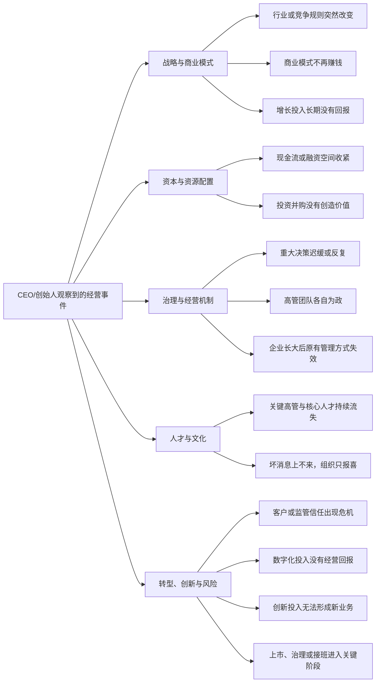

# B版：CEO Master Skill 参与的经营事件体系与题项映射

## 一、生成原则

本版不继承旧的8类事件。`ceo-master` 从CEO职责重新识别客户入口，覆盖战略、资本配置、高管团队、治理决策、文化、风险、创新和企业阶段切换。

人物经验只用于提出候选解释，不作为评分标准；不能用“是否像Bezos、Grove或任正非”评价企业。

## 二、事件总图

## 三、事件—核心题—关联事件—补充题映射

| ID | CEO可选择的经营事件 | 核心题 | 第一轮推荐方向 | 可能关联事件 | 关联事件触发的补充题 |
|---|---|---|---|---|---|
| B01 | 行业、技术或竞争规则突然改变，原战略开始失效 | Q1行业阶段、Q2核心资源、Q3战略规划、Q20市场洞察 | 战略转折点与竞争定位 | B02商业模式失效；B03增长投资失效；B08阶段错配 | B02→Q5/Q21/Q50；B03→Q25/Q44/Q45；B08→Q8/Q11/Q53 |
| B02 | 收入仍有但越来越不赚钱，原商业模式失效 | Q5商业模式、Q21产品定价、Q25财务预算、Q50模式复盘 | 盈利逻辑与战略重构 | B01战略转折；B03资源错配；B04现金压力 | B01→Q1/Q2/Q20；B03→Q33/Q44/Q45；B04→Q18/Q27/Q34 |
| B03 | 新业务、扩张或增长投入长期没有达到预期 | Q25预算、Q33资本规划、Q44创新投入、Q45创新组合 | CEO资源配置与增长组合 | B01战略误判；B02模式失效；B13创新不转化 | B01→Q1/Q3/Q20；B02→Q5/Q21/Q50；B13→Q46/Q49/Q55 |
| B04 | 现金流紧张、授信不足或融资空间快速收紧 | Q18库存资金、Q25财务预算、Q33资本规划、Q34融资授信 | 现金与资本结构 | B02盈利模式失效；B03资源错配；B11风险危机 | B02→Q5/Q21/Q50；B03→Q35/Q44/Q45；B11→Q26/Q27/Q29 |
| B05 | 投资并购完成后没有产生协同或持续拖累经营 | Q25财务预算、Q27风险管理、Q35投资决策、Q36并购整合 | 投资纪律与并购整合 | B03资本错配；B07高管不协同；B08阶段错配 | B03→Q33/Q44/Q45；B07→Q6/Q8/Q30；B08→Q11/Q15/Q53 |
| B06 | 重大决策越来越慢、经常反复或最终只靠一人拍板 | Q6治理决策、Q9授权、Q27风险管理、Q29数据决策 | CEO决策与治理机制 | B07高管不协同；B10坏消息不上行；B08管理方式失效 | B07→Q4/Q8/Q30；B10→Q31/Q32/Q41；B08→Q10/Q11/Q53 |
| B07 | 高管团队各自为政，战略和资源争夺无法形成一致 | Q4战略解码、Q6治理决策、Q8组织匹配、Q30责任落实 | 高管团队与共同经营目标 | B06决策失效；B09关键人才流失；B10坏消息不上行 | B06→Q9/Q27/Q29；B09→Q7/Q14/Q15；B10→Q31/Q41/Q43 |
| B08 | 企业规模扩大后，原来有效的管理方式突然失效 | Q8组织匹配、Q10流程、Q11人力结构、Q53组织灵活 | 跨阶段组织与经营系统升级 | B06决策迟缓；B07高管失配；B12数字化无回报 | B06→Q6/Q9/Q29；B07→Q4/Q14/Q30；B12→Q28/Q31/Q52 |
| B09 | 关键高管和核心人才持续流失，继任者接不上 | Q7长期激励、Q11人力结构、Q14绩效、Q15人才梯队 | 高管团队、人才密度与继任 | B07高管失配；B10文化失真；B14接班阶段 | B07→Q6/Q8/Q30；B10→Q12/Q13/Q39/Q40/Q41/Q43；B14→Q37/Q38/Q56 |
| B10 | 坏消息无法上报，经营会议总是全绿或事后才暴雷 | Q27风险管理、Q29数据决策、Q31跟踪反馈、Q41组织氛围 | 经营节奏、真实信息与文化机制 | B06决策失效；B07高管不协同；B11信任危机 | B06→Q6/Q9/Q30；B07→Q14/Q32/Q42/Q43；B11→Q17/Q26/Q48 |
| B11 | 重大质量、合规、客户或舆情事件正在损害信任 | Q17质量、Q22客户管理、Q26合规、Q27风险管理 | 危机治理与客户信任修复 | B10坏消息不上行；B06治理失效；B02商业模式问题 | B10→Q29/Q31/Q41；B06→Q6/Q9/Q43；B02→Q5/Q21/Q48 |
| B12 | 数字化投入持续增加，但效率、决策和利润没有改善 | Q25预算、Q28系统覆盖、Q29数据决策、Q52流程敏捷 | 数字化经营机制与投资回报 | B08阶段错配；B10信息失真；B03资源错配 | B08→Q8/Q10/Q11；B10→Q31/Q32/Q41；B03→Q33/Q44/Q45 |
| B13 | 创新投入、研发和试点很多，但没有形成新业务 | Q44创新投入、Q45创新组合、Q49新模式、Q55成果转化 | 创新资本配置与商业化 | B01战略转折；B03资源错配；B10坏消息不上行 | B01→Q1/Q2/Q20；B03→Q25/Q33/Q35；B10→Q29/Q31/Q54 |
| B14 | 企业进入上市、治理规范化或创始人接班的关键阶段 | Q6治理决策、Q33资本规划、Q37上市规划、Q38市值意识 | 治理、资本市场与领导交接 | B09继任不足；B10信息失真；B05投资治理 | B09→Q7/Q15/Q43；B10→Q27/Q29/Q31；B05→Q35/Q36/Q50 |

## 四、按条件触发的专业题项

- 制造企业：B04、B11、B12可追加Q16—Q19；非制造企业不展示。
- 销售与客户问题：B01—B03、B11可追加Q23、Q24、Q48。
- 合规与风险：B04、B06、B10、B11必须把Q26、Q27视为待核验事实，而非主观成熟度结论。
- 创新技术证据：B03、B13可追加Q46、Q47、Q51、Q54，但专利、研发团队或合作数量不等于商业成果。
- 上市与并购：Q35—Q38只在客户明确选择相关事件时出现，不进入普通企业的默认问答。

## 五、动态问答规则

1. 首屏事件随客户角色切换：创始人/CEO优先显示B01—B14；部门负责人优先使用A版。
2. 客户选中事件后只回答3—4道核心题。
3. 第一轮只推荐一个CEO咨询方向，不显示置信度。
4. 系统把核心答案转换为“待确认的关联事件”，而不是直接宣布根因。
5. 客户确认关联事件后，再展示该分支的补充题。
6. 完成补充题后，才按覆盖度、答案一致性、跨模块印证和证据类型计算推荐置信度。
7. 所有结论必须显示题号与答案来源；CEO人物经验不得成为企业评分依据。
